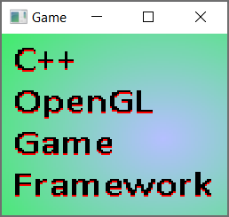

# C++ OpenGL Game Framework



This is a starter project for creating a window, getting user input from it, rendering content to its screen, and playing audio.

This starter kit is designed to make it as easy as possible to create any type of graphics project (video game, simulation, etc), build an executable from it, and share the software with others.

The project has only been tested on Windows, but it should theoretically work on Linux with minimal tweaking. 

Switch to the `example` branch using `git checkout example` to see a simple demo!

## Features

* Easily prototype modern OpenGL graphics applications
* Easily compile shaders from both files and strings
* Easily load a PNG image from disk and bind it to a shader
* Easily play OGG sound files
* Easily get keyboard and mouse input
* Easily encapsulate game functionality using the `Scene` class

## Libraries used

* glad, for using OpenGL
* glfw3, for creating the window and user input
* glm, a vector math library
* SFML, for its audio wrapper around openal-soft for OGG files
* stb, for reading and writing PNG images
* in the future, FreeType will be added for text rendering

## License

This project is licensed under the **MIT License** (see `LICENSE.txt`) and created by **Daniel Fuerlinger**. If you fork this project or do anything else with it, you may not remove my copyright notices. But of course, you may specify licensing and copyrights for your own additions to the codebase.

The `data/LICENSE.txt` file will be copied into the executable's directory when built. As long as you redistribute your executable with this license included, your software *should* satisfy the licensing requirements of all the third party libraries and enable you to sell your software commercially. I am not a legal expert though, so this is may not be the case.

**Make sure to update the `data/LICENSE.txt` file** to have your name and the name of your software at the very top, instead of my name and cpp-opengl-game-framework. Additionally, **you are responsible for updating this file** to include any licensing and copyright information which goes beyond this simple project. This would include if you added a library to the project or used copyrighted game assets, among other things.

# Building

This project uses **CMake** with a single `CMakeLists.txt` file to build an executable. A `CMakeSettings.json` file is provided for Visual Studio users. After cloning the project you can open `CMakeLists.txt` using Visual Studio with `File > Open > CMake`, or use the command line like so:

```
git clone https://github.com/Fuerdinger/cpp-opengl-game-framework.git
cd cpp-opengl-game-framework
mkdir bin
cd bin
cmake ..
```

The **vcpkg** package manager is required to build the project on Windows. Make sure that the environment variable `%VCPKG_ROOT%` is specified and that it points to the root directory of your installation of vcpkg. For example, `C:\src\vcpkg`

Instructions for downloading vcpkg: https://vcpkg.io/en/getting-started.html

It is recommended to use a vcpkg triplet which requires SFML and its dependencies to be dynamically linked against the executable. This is because one of SFML's dependencies is openal-soft, which is licensed under LGPL. If you don't dynamically link an LGPL library, then your project becomes infected by the LGPL license, which prevents you from using it for commercial purposes. Here is a vcpkg triplet you may use that makes all libraries statically linked, except for SFML and openal-soft.

```
set(VCPKG_TARGET_ARCHITECTURE x64)
set(VCPKG_CRT_LINKAGE dynamic)
if(PORT MATCHES "(openal-soft|sfml)")
	set(VCPKG_LIBRARY_LINKAGE dynamic)
else()
	set(VCPKG_LIBRARY_LINKAGE static)
endif()
```

## Documentation

If **Doxygen** is installed, then CMake will use Doxygen to generate HTML documentation for the project, which is output to a directory named `docs/`. All the classes I wrote are well documented, but reading "Getting started" and using Intellisense will likely be good enough to figure out how everything works.

# Getting started

The entry point for the project is in `main()`.

```
int main()
{
	SceneManager manager;
	manager.build();
	manager.run({ new DefaultScene() });
	return 0;
}
```

Here, a `SceneManager` class is initialized, which sets up everything you need. Once its `build()` function has been called, it may be run using a vector of `Scene` objects specified by the user. Caling `run()` will begin the main loop of the application, which will run `Scene` logic for whatever the current `Scene` is.

As a user of this project, nearly all of your code will live inside `Scene` classes you specify. Here is an example of one:

```
#include "Scene.h"

class DefaultScene : public Scene
{
private:
	SoundPlayer* m_backgroundMusic;
	SoundPlayer* m_sfx;
	Image* m_image;
	GLuint m_program;
	GLuint m_vao;
public:
	DefaultScene() : Scene("DefaultScene") 
	{
		_sounds->loadMusic("CoolSong");
		m_backgroundMusic = _sounds->createSoundPlayer("CoolSong");
		m_backgroundMusic->setLoop(true);

		_sounds->loadSFX("BlipSound");
		m_sfx = _sounds->createSoundPlayer("BlipSound");
		
		m_image = new Image("SomePNGFile");
		m_image->loadToCPUFromDisk();
		m_image->loadToGPUFromCPU();
		m_image->freeFromCPU();

		m_program = _util->createProgram(
			R""""(
			#version 430 core
			out vec2 uv;
			const vec2 vertices[3] = { vec2(-1.0f, -1.0f), vec2(3.0f, -1.0f), vec2(-1.0f, 3.0f) };
			void main()	{
				gl_Position = vec4(vertices[gl_VertexID], 0, 1);
				uv = 0.5f * gl_Position.xy + vec2(0.5f, 0.5f); }
		)"""", R""""(
			#version 430 core
			in vec2 uv;
			out vec4 color;
			layout(binding = 0) uniform sampler2D myTexture;
			void main(void) {
				color = texture(myTexture, uv); }
		)"""");

		glGenVertexArrays(1, &m_vao);
	}
	~DefaultScene()
	{
		m_image->unbindToShader();
		glDeleteProgram(m_program);
		glDeleteVertexArrays(1, &m_vao);
		delete m_image;
	}
	void switchFrom(const std::string& previousScene, void* data = nullptr)
	{
		glBindVertexArray(m_vao);
		glUseProgram(m_program);
		m_image->bindToShader();
		m_backgroundMusic->play();
	}
	void update(float deltaTime)
	{
		if (_window->keyJustPressed(GLFW_KEY_W))
		{
			m_sfx->play();
		}
	}
	void render() 
	{ 
		glClear(GL_COLOR_BUFFER_BIT);
		glDrawArrays(GL_TRIANGLES, 0, 6);
	}
};
```

A `Scene` has 5 key functions to worry about: its `constructor`, `destructor`, `switchFrom()`, `update()`, and `render()`. 

* The `constructor` will be called before the `SceneManager` begins the main loop, making it a good place to do things like load images, sound effects, create shader programs, and create vertex buffers.

* The `destructor` will be called once the `SceneManager` exits the main loop (ie, when the user closes the window), making it a good place to delete any allocated resources. Above, certain resources (specifically, the `SoundPlayers`) are not explicitly deleted, because `_sounds` will do it for us.

* `switchFrom()` will be called when another `Scene` switches to this one. When the `SceneManager's` main loop begins, it will be called on whatever the first scene is. This is a good place to prepare the `Scene` for updating and rendering, but usually a bad place to initialize resources.

* `update()` will be called once every iteration of the `SceneManager's` main loop. It is a good place to get user input, and then manipulate the `Scene's` internal state based on the input. Here, it plays a sound effect when the user presses the W key.

* `render()` will be called once every iteration of the `SceneManager's` main loop. It is a good place to make OpenGL calls to render the internal state of `Scene` to the screen. Here, it renders 6 vertices using the shader and VAO which were bound in `switchFrom()`.

A Scene's constructor is not the only place we can load images or sounds. We can rewrite `main()` to achieve this, as well as specify some window properties we ignored earlier. 

```
int main()
{
	SceneManager manager(new WindowManager("My Game", WindowManager::State::FULLSCREEN, WindowManager::Mode::FPP));

	std::vector<Image*> myImages = {new Image("CharacterRunning"), new Image("CharacterWalking")};
	for (auto image : myImages)
	{
		image->loadToCPUFromDisk("images\\");
		image->loadToGPUFromCPU();
		image->freeFromCPU();
	}
	manager.createImages(new ImageManager(myImages));

	std::vector<std::string> sfx = { "Jump", "Blip", "Shoot" };
	std::vector<std::string> music = { "Background", "Level", "Credits" };
	SoundManager::setPath("sounds\\");
	manager.createSounds(new SoundManager(sfx, music));

	manager.build();

	std::vector<Scene*> scenes = {new MenuScene(), new LevelScene(), new CreditsScene()};
	manager.run(scenes);

	return 0;
}
```

* Here, we create a fullscreen window which will use first person camera controls (ie, it hides the mouse), and if we were to change the window to be draggable later, it would be called "My Game" in the window decorator.

* A couple PNG images are loaded in from memory, and then passed to the `ImageManager` we create. These are accessible via `_images` in a `Scene` class.

* A couple sound effects and music files (all OGGs) are loaded by the `SoundManager` we create. These are accessible via `_sounds` in a `Scene` class.

* Finally, we call `build()` to finish initializing the `SceneManager`, then construct our `Scenes` which we pass to the `run()` function. Do not initialize any `Scenes` until **after** you've called `build()`!

## Where should my assets live?

You may have noticed in the above example that we specified some paths to where our PNGs and OGGs reside on the file system. The `SoundManager`, `ImageManager`, and `Image` classes all have functions which allow you to specify where to load these files from.

But, how do these files become relative to the executable? This is done via CMake.

As part of the CMake build process, any files in directories named `data/` or `untracked_data/` will be copied into the executable's directory. The only difference between these two directories is that `untracked_data/` is ignored in the `.gitignore` file; as such, it is not part of the repository, so you will need to create it yourself if you want it.

Here is an example of how you could separate your assets. Shaders could go in `data/` so they are tracked by git, but the OGG and PNG files could go in `untracked_data/` so they are not tracked by git.

```
|-> MyProject

    |-> data/
        |-> LICENSE.txt
        |-> shaders/
            |-> Vert.shader
            |-> Frag.shader

    |-> untracked_data/
        |-> SillyFooFile.txt

        |-> sounds/
            |-> Jump.ogg
            |-> Blip.ogg
            |-> Shoot.ogg
            |-> Background.ogg
            |-> Level.ogg
            |-> Credits.ogg
            
        |-> images/
            |-> CharacterRunning.png
            |-> CharacterWalking.png
```

After building with CMake, the executable's directory will look like:

```
|-> x64-Debug / MyProject

    |-> MyProject.exe

    |-> LICENSE.txt

    |-> SillyFooFile.txt

    |-> shaders/
        |-> Vert.shader
        |-> Frag.shader

    |-> sounds/
        |-> Jump.ogg
        |-> Blip.ogg
        |-> Shoot.ogg
        |-> Background.ogg
        |-> Level.ogg
        |-> Credits.ogg

    |-> images/
        |-> CharacterRunning.png
        |-> CharacterWalking.png
```

Notice that the `data/` and `untracked_data/` directories themselves were not copied; only their contents were.

## Using CRTDBG

If you use CRTDBG to check for memory leaks, you may notice two memory leaks which occur if you load a sound effect or music file. This is not a true memory leak and instead seems to be a bug with the OpenAL32.dll file which CMake creates and puts into the executable directory of debug builds. You can be assured that all memory created by this project in the various manager classes (`SceneManager`, `ImageManager`, `SoundManager`, etc) is cleaned up properly by the time the program exits.

## Give the demo a try

Switch to the `example` branch using `git checkout example` to see a simple demo! The example creates a `Scene` in `main.cpp` which displays the project's logo and plays audio in the background.
