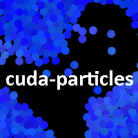

# CUDA Particle Simulator



Simulate beautiful particle collisions on your NVIDIA GPU with CUDA and C++!

The collision handling algorithm is a simple algorithm which checks all particle pairs to see if they are colliding, giving it a runtime of O(N^2). But by the power of modern GPUs such as the NVIDIA RTX 3080, I was able to run this simulation at 144fps with 10,000 particles (~100,000,000 collision checks every 7 milliseconds!)

Download prebuilt executable on itch.io: https://fuerdinger.itch.io/cuda-particles

Video demo on YouTube: https://youtu.be/elHo8D7NW40

This project is a fork of [cpp-opengl-game-framework](https://github.com/Fuerdinger/cpp-opengl-game-framework).

Visit my website to see more projects: https://www.danielfoobar.com

## Features

* 2D spherical particle collisions
* Procedurally generated audio
* Interact with the simulation using your mouse
* Simulation can be customized using json config files
* Simulate water, slime, sand, confetti, and more!

## Libraries used

* CUDA, for particle physics
* glad, for using OpenGL
* glfw3, for creating the window and user input
* glm, a vector math library
* SFML, for its audio wrapper around openal-soft for OGG files
* stb, for reading and writing PNG images
* nlohmann::json for reading config files

## License

This project is licensed under the **MIT License** (see `LICENSE.txt`) and created by **Daniel Fuerlinger**. If you fork this project or do anything else with it, you may not remove my copyright notices. But of course, you may specify licensing and copyrights for your own additions to the codebase.

I do not claim ownership over any video or audio content you create using this software. If you make a particle simulation and want to use a video of it in an advertisement, monetized YouTube video, etc, then go for it. But if you use this software to create such content, I would appreciate if you could mention that it was created using this software.

The sound effects used by this software (located in the [data](data) folder) were generated from another piece of software called [pxtone](https://studiopixel.sakura.ne.jp/pxtone/). I do not claim copyright over them, and I assume that these sound effects are not copyrighted by the creator of pxtone but I could be mistaken.

# Building

This project uses **CMake** with a single `CMakeLists.txt` file to build an executable. A `CMakeSettings.json` file is provided for Visual Studio users. After cloning the project you can open `CMakeLists.txt` using Visual Studio with `File > Open > CMake`, or use the command line like so:

```
git clone https://github.com/Fuerdinger/cuda-particles.git
cd cuda-particles
mkdir bin
cd bin
cmake ..
```

The **vcpkg** package manager is required to build the project on Windows. Make sure that the environment variable `%VCPKG_ROOT%` is specified and that it points to the root directory of your installation of vcpkg. For example, `C:\src\vcpkg`

Instructions for downloading vcpkg: https://vcpkg.io/en/getting-started.html

It is recommended to use a vcpkg triplet which requires SFML and its dependencies to be dynamically linked against the executable. This is because one of SFML's dependencies is openal-soft, which is licensed under LGPL. If you don't dynamically link an LGPL library, then your project becomes infected by the LGPL license, which prevents you from using it for commercial purposes. Here is a vcpkg triplet you may use that makes all libraries statically linked, except for SFML and openal-soft.

```
set(VCPKG_TARGET_ARCHITECTURE x64)
set(VCPKG_CRT_LINKAGE dynamic)
if(PORT MATCHES "(openal-soft|sfml)")
	set(VCPKG_LIBRARY_LINKAGE dynamic)
else()
	set(VCPKG_LIBRARY_LINKAGE static)
endif()
```

## Documentation

If **Doxygen** is installed, then CMake will use Doxygen to generate HTML documentation for the project, which is output to a directory named `docs/`. Only the code taken from [cpp-opengl-game-framework](https://github.com/Fuerdinger/cpp-opengl-game-framework) is documented.


# Running

See the [README](data/README.txt) for the simulation's controls and how to customize its behavior.

